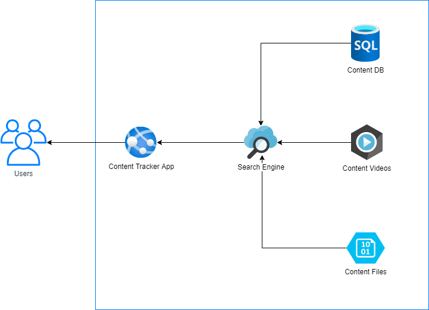

# Content Tracker App

Content Tracker App is a search mechanism created to showcase the utilization of different components in Microsoft Azure working together.

By combining the efficiency of Microsoft SQL Databases with Azure Cognitive Search and Video Indexer, this solution delivers a unified search experience, that can get developers started right-the-way.

## Solution's components

* [Azure App Service](https://azure.microsoft.com/en-us/services/app-service/): App Service Web App is used to host de web application (written in .NET Core).
* [Azure SQL Databases](https://azure.microsoft.com/en-us/services/sql-database/): Experimentally, we hold some data into a SQL Database to serve one of the indexers of the search.
* [Azure Cognitive Search](https://azure.microsoft.com/en-us/services/search/): Azure Cognitive Search takes de data and performs both search and classification into data coming in from relational database and static files sitting on Azure Storage.
* [Azure Storage Account](https://azure.microsoft.com/en-us/services/storage/): Holds static data (PDFs, PPTs, DOCXs, etc) that serves the search engine.
* [Azure Video Indexer](https://azure.microsoft.com/en-us/services/media-services/video-indexer/): Indexes videos, and by calling its APIs, we're able to look for the content inside the video.

## Architecture

Here's the proposed architecture for the solution.

## Implementation details

I have described in details the implementation process in a blog post in [fabriciosanchez.com](https://fabriciosanchez.com).

* Blog post: [https://fabriciosanchez-en.azurewebsites.net/building-a-content-tracker-with-azure-cognitive-search-and-video-indexer-api/](https://fabriciosanchez-en.azurewebsites.net/building-a-content-tracker-with-azure-cognitive-search-and-video-indexer-api/)